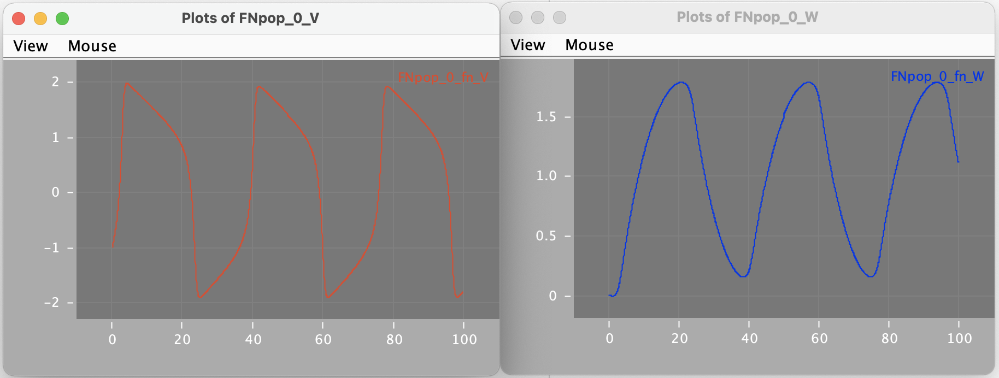

# Interactions between NeuroML and MDF

## 1) Converting NeuroML to MDF

## 1.1) Simple ABCD model

**Summary: A model is created in NeuroML (using cell dynamics specified in LEMS and a network in NeuroMLlite) and converted to the equivalent model in MDF, which runs with the reference MDF execution engine.**

### NeuroMLlite version

[ABCD.py](ABCD.py) is a script using the [NeuroMLlite](https://docs.neuroml.org/Userdocs/Software/NeuroMLlite.html) package to create a simple network with 4 connected elements. The network built can be seen below (this can be generated with `python ABCD.py -graph2`):

<p align="center"></p>

A version of the network in NeuroML 2 can be generated with `python ABCD.py -nml`, or generated and executed with jNeuroML with `python ABCD.py -nml`.
This will produce the NeuroML file: [ABCD.net.nml](ABCD.net.nml) (note though this is not valid, as not all the elements included are pure NeuroML). A [LEMS Simulation file](https://docs.neuroml.org/Userdocs/LEMSSimulation.html) is generated for running the model in jNeuroML or pyNeuroML: [LEMS_SimABCD.xml](LEMS_SimABCD.xml)

The definitions of the components used for A, B, etc. can be found in [PNL.xml](PNL.xml). This is a set of definitions of component types based on those present in PsyNeuLink. A graph depicting the definitions of the network elements can be generated with `pynml LEMS_SimABCD.xml -lems-graph`:

<p align="center"></p>


A version of the network in MDF can be generated from NeuroMLlite definition with: `python ABCD.py -mdf` producing [ABCD.mdf.yaml](ABCD.mdf.yaml) and [ABCD.mdf.json](ABCD.mdf.json).

A graph of the structure of the MDF model can be generated with: `python -m modeci_mdf.interfaces.graphviz.exporter ABCD.mdf.yaml 1` (left below), or with more detail: `python -m modeci_mdf.interfaces.graphviz.exporter ABCD.mdf.yaml 3` (right below.)

<p align="center"> 
</p>


## 1.2) FitzHugh Nagumo cell models

### NeuroML version

A version of the FitzHugh Nagumo neuron model has been specified in LEMS ([LEMS_SimFN.xml](LEMS_SimFN.xml)) for use in NeuroML ([FN.net.nml](FN.net.nml)).
A graphical representation of the LEMS is below:

<p align="center"></p>

The network is originally specified in NeuroMLlite ([FN.py](FN.py)) and is generated in LEMS and run with:
```
python FN.py -jnml      # Generate the LEMS file from the NeuroMLlite description
pynml LEMS_SimFN.xml    # Run the LEMS file using pyNeuroML
```




### NeuroML to MDF


The NeuroMLlite version can be used to generate MDF for the model:

```
python FN.py -mdf      # Generate the MDF serializations (JSON and YAML) from the NeuroMLlite description
```

These can be seen here: [FN.mdf.json](FN.mdf.json), [FN.mdf.yaml](FN.mdf.yaml), and a graphical version generated with:

```
python -m modeci_mdf.interfaces.graphviz.importer FN.mdf.yaml 3    #  Generate graph from MDF version
```

<p align="center"></p>


### Execute model using MDF

The model can be loaded and run in MDF using the standard scheduler with:

```
python FNrun.py    # Load FN model and run with MDF scheduler
```

<p align="center"></p>
